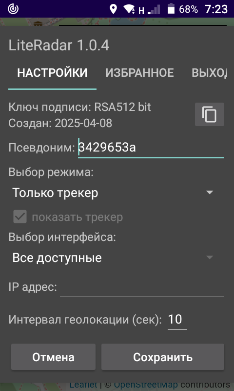
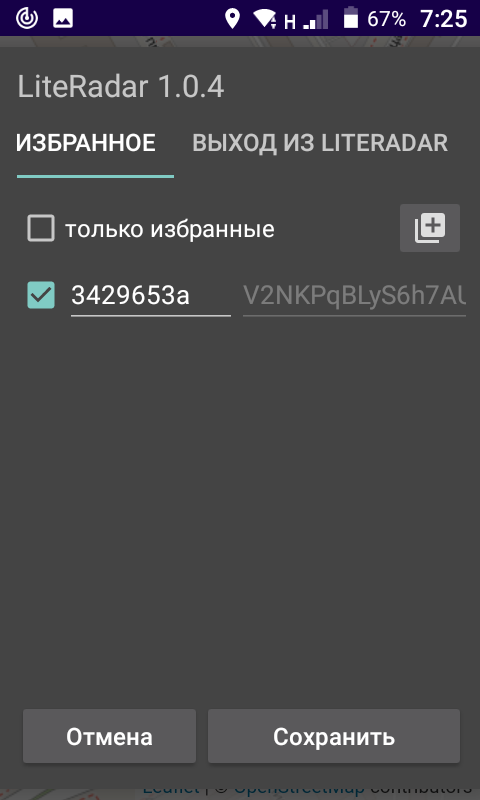

## LiteRadar Android транспондер, MIT (c) 2022-2025 @miktim [en](./README.md)

### Назначение  
Обмен в группе или передача на сервер собственного GNSS местоположения по протоколу UDP.  

Сборка .apk здесь: [./app/release/](./app/release/)  

### Требования  
Android 6+  
Разрешение экрана 800х480 и выше.   

### Ограничения
Сетевые функции могут быть ограничены политикой вашего оператора сотовой связи и возможностями устройства Android.  

### Общие сведения  
Компоненты приложения:  
\- [транспондер](https://ru.ruwiki.ru/wiki/%D0%90%D0%97%D0%9D-%D0%92) - фоновый высокоприоритетный сервис для определения местоположения и обмена данными;  
\- трекер для отображения объектов на карте местности;  
\- панель управления.  

Индентификатором транспондера при передаче данных по сети служит открытый ключ ассиметричного алгоритма шифрования. Подтверждение подлинности обеспечивает цифровая подпись пакета данных. Для обмена идентификатором между пользователями используется тег - сокращенный вариант открытого ключа.  
Необязательное имя (псевдоним) транспондера имеет вспомогательное значение.  

### Уведомления
  
Состояние транспондера указано в Android уведомлении. Сообщения об ошибках геолокации или сети сопровождаются звуковым сигналом.  
Для вызова панели управления или восстановления фокуса приложения коснитесь текста уведомления.  

### Панель управления  
Завершение работы транспондера производится из панели управления.  
Кнопка "Сохранить" вызывает перезапуск сервиса.

#### Настройки
  

Раздел идентификации содержит информацию о ключе цифровой подписи и редактируемом необязательном имени (псевдониме) транспондера.  
Кнопка справа копирует тег транспондера в буфер обмена для дальнейшей передачи заинтересованным лицам любым доступным способом (см. Избранные).  
 
Режимы работы:  
\- только трекер (по умолчанию). Данные о собственном местоположении в сеть не передаются.  
\- член UDP группы многоадресной рассылки. Передача и прием данных геолокации.  
\- UDP клиент с указанием IP адреса и порта сервера. Только передача данных.  

В последних двух случаях возможен выбор сетевого интерфейса.  

Интервал геолокации устанавливает периодичность определения местоположения и отправки пакета данных.  

#### Избранное (свой-чужой)
  

Только для режима "член UDP группы". Вкладка содержит список транспондеров с их именем (псевдонимом), сроком действия пакета данных и тегом. Список изменяется по мере приема данных.  
Предоставляет возможность пометить транспондер, как избранный и изменить его имя для трекера или добавить транспондер, вставив полученный тег из буфера обмена кнопкой справа.  
Удаление не избранных записей производится по мере истечения срока действия пакета данных.  
Флажок "только избранные" фильтрует отображение транспондеров трекером.  

### Трекер
Трекер показывает положение транспондеров на местности. Собственный, избранные и прочие транспондеры выделяются иконками разного цвета.  
Подробнее о трекере см. README https://github.com/miktim/mini-tracker  

### Замечания по реализации

Настройки трекера хранятся в файле settings.json приложения.  
В случае аварийного завершения создается файл fatal.log.

Алгоритм шифрования: RSA 512 bit.  
Цифровая подпись: SHA256withRSA  
Тег: base64 encoded SHA1 hash бинарного представления открытого ключа. Передается трекеру в качестве идентификатора.     
Имя по умолчанию: hex 32 bit hash тега.  
UDP multicast group: 224.0.9.090:9099, time-to-live = 10  

#### Взаимодействие с трекером  
Транспондер передает данные трекеру в формате JSON.  
Intent Action: "org.literadar.tracker.ACTION"  
Intent extra data: "json"  
События и ответы трекера:  
Intent Action: "org.literadar.tracker.EVENT"  
Intent extra data: "json"  

Структура JSON пакета и управление трекером см. README https://github.com/miktim/mini-tracker  

Завершить работу транспондера:  
Intent Action: "org.literadar.EXIT"  

#### Структура UDP пакета  
Данные пакуются в BigEndian порядке. Значения Double преобразуются в IEEE 754 long.

| Байт | Содержание |
|:----:|------------|
| 4    | magic number "LRdr" |
| 1    | unsigned byte, length of public key in bytes (k) |
| k    | RSA public key |
| 2    | packet version |
| 1    | unsigned byte, length of transponder name (n) |
| n    | UTF-8 transponder name (0:16 chars) |
| 8    | long, timestamp in milliseconds (Epoch from 1 january 1970) |
| 2    | short, location timeout in seconds (> 0) |
| 8    | double, WGS-84 latititude in degrees (-90 : 90) |
| 8    | double, WGS-84 longitude in degrees (-180 : 180) |
| 2    | short, accuracy in meters (> 0)|
| ...  | reserved |
| s    | digital signature |
| 1    | unsigned byte, signature length (s) |  

