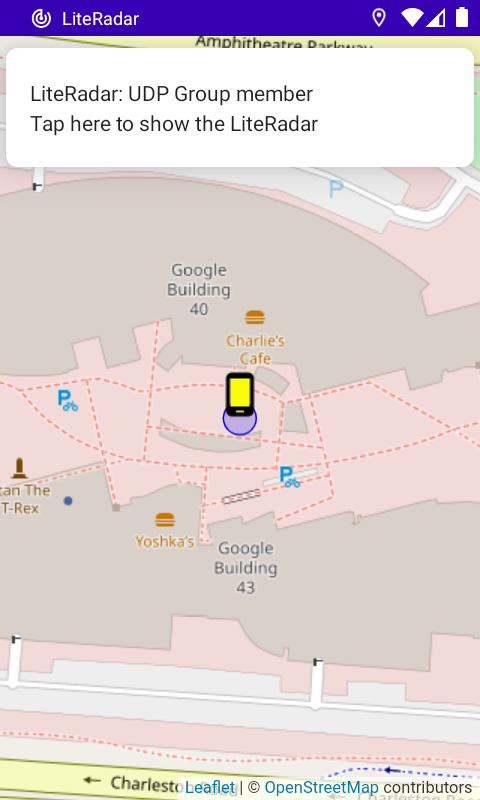
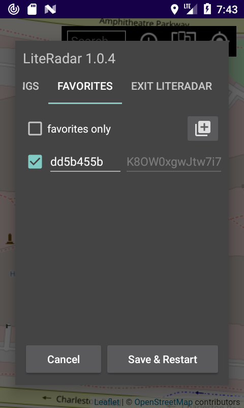

## LiteRadar Android transponder, MIT (c) 2022-2025 @miktim [ru](./README-RU.md)

### Purpose
LiteRadar Android transponder: sharing in a group or transmitting your own location to the server via UDP protocol.  

Latest .apk build here: [./app/release/](./app/release/)  

### Requirements  
Android 6+  
Screen resolution 800x480 and higher.  

### Restrictions  
Network features may be limited by your cellular provider's policies or Android device capabilities.  

### General information  
The transponder identifier for data transmission over the network is the public key of the asymmetric encryption algorithm. The authenticity of the data packet is confirmed by a digital signature.  
The tag, an abbreviated version of the public key, is used to exchange the identifier between users.  
The optional name (alias) of the transponder has an auxiliary meaning.  

Application components:  
\- [transponder](https://en.wikipedia.org/wiki/Automatic_Dependent_Surveillance%E2%80%93Broadcast) - background high-priority service for determining location and exchanging data;  
\- tracker for displaying objects on a map;  
\- control panel.  
 
### Notifications  
  
The LiteRadar transponder status is displayed in an Android notification. Location or network error messages are accompanied by a sound signal.  
To access control panel or restore app focus, tap the notification text.  

### Control panel  
The transponder is shut down from the control panel.  
The "Save & Restart" button causes the service to restart.  

#### Settings  
  
  The identification section contains information about the digital signature key and an editable optional name (alias) of the transponder.
The button on the right copies the transponder tag to the clipboard for further transmission to interested parties by any available means (see Favorites).  

Operation modes:  
\- tracker only (default). No location data is transmitted to the network.  
\- member of UDP multicast group. Transmitting and receiving geolocation data.  
\- UDP client with specifying IP address and port or available host name and server port. Data transmission only.  

In the last two cases, it is possible to select a network interface.  

The geolocation interval sets the frequency at which location is determined and data packets are sent.  
  
#### Favorites (friend or foe)  
  
For UDP group member mode or LiteRadar server clients. The tab contains a list of transponders with their name (alias), data packet expiration date and tag. The list changes as data is received.  
Provides the ability to mark a transponder as favorite and change its name for the tracker or add a transponder by pasting the received tag from the clipboard using the button on the right.  
Unselected entries are deleted as the data packet expires.  
The "favorites only" checkbox filters the display of transponders by the tracker.  

### Tracker
The tracker displays the location of transponders on the map. Own, favorite and other transponders are highlighted with icons of different colors.  
For more information about the tracker, see README https://github.com/miktim/mini-tracker  

### Release notice  
Tracker settings are stored in the application's settings.json file.  
In case of a crash, a fatal.log file is created.  

Encryption algorithm: RSA 512 bit.  
Digital signature: SHA256withRSA  
Tag: base64 encoded SHA1 hash of the binary representation of the public key. It is passed to the tracker as an identifier.  
Default name: hex encoded 32 bit hash of the tag.  
UDP multicast group: 224.0.1.199:9099, time-to-live = 20  

#### UDP packet structure  
Data is packed in BigEndian order. Double values ​​are converted to IEEE 754 long.  

| Bytes | Contents |
|:----:|------------|
| 4    | magic number "LRdr" |
| 1    | unsigned byte, length of public key in bytes (k) |
| k    | public key |
| 2    | packet version |
| 1    | unsigned byte, length of transponder name (n) |
| n    | UTF-8 transponder name (0:16 chars) |
| 8    | long, timestamp in milliseconds (Epoch from 1 january 1970) |
| 2    | short, location timeout in seconds (> 0) |
| 8    | double, WGS-84 latititude in degrees (-90 : 90) |
| 8    | double, WGS-84 longitude in degrees (-180 : 180) |
| 2    | short, accuracy in meters (> 0)|
| ...  | reserved |
| s    | signature |
| 1    | unsigned byte, signature length (s) |  
  
  
