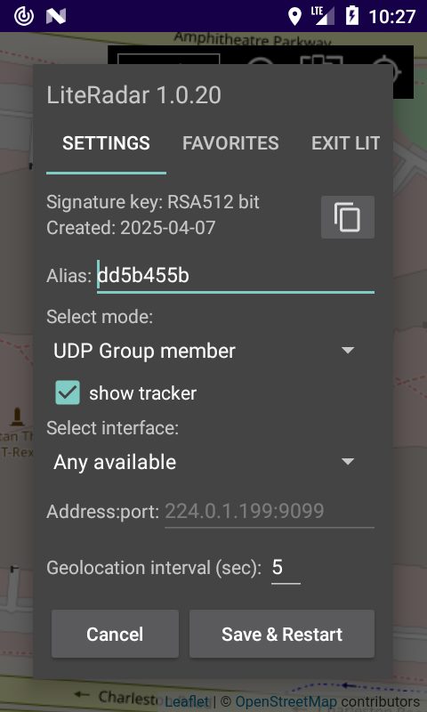

## LiteRadar Android transponder, MIT (c) 2022-2025 @miktim

### Назначение  
Обмен в группе или передача на сервер собственного местоположения по протоколу UDP.  

Последний релиз приложения здесь: [./app/release/](./app/release/)  

### Требования  
Android 6+, Harmony OS 3+  

### Использование  

#### Идентификация  
Индентификатором транспондера при передаче данных по сети служит открытый ключ RSA512. Подтверждение подлинности обеспечивает цифровая подпись пакета данных. При ином способе обмена: идентификатор - base64 encoded SHA1 hash бинарного представления открытого ключа.  
Необязательное имя (псевдоним) транспондера имеет вспомогательное значение.

#### Режимы работы
  
\- только трекер (по умолчанию). Данные о собственном местоположении в сеть не передаются.  
\- член UDP multicast группы: 224.0.9.090:9099, time-to-live = 10 Передача и прием данных геолокации.  
\- UDP клиент с указанием IP адреса и порта или имени доступного хоста и порта сервера. Только передача данных.  

В последних двух случаях возможен выбор сетевого интерфейса.

#### Уведомления  
  
Состояние транспондера указано в Android уведомлении. Сообщения об ошибках геолокации или сети сопровождаются звуковым сигналом.  
Для вызова настроек коснитесь текста уведомления.  

#### Взаимодействие с трекером
Транспондер передает данные трекеру в формате JSON.  
Intent Action: "org.literadar.tracker.ACTION"  
Intent extra data: "json"  
Структура JSON пакета и управление трекером см. README https://github.com/miktim/mini-tracker  

#### Дополнительные настройки  
Настройки трекера хранятся в файле settings.json приложения.

### Структура UDP пакета  
Данные пакуются в BigEndian порядке. Значения Double преобразуются в IEEE 754 long.

| Байт | Содержание |
|:----:|------------|
| 4    | magic number "LRdr" |
| 1    | unsigned byte, length of public key in bytes (n) |
| n    | public key |
| 2    | packet version |
| 1    | unsigned byte, length of transponder name (m) |
| m    | transponder name (UTF-8) |
| 8    | long, timestamp in milliseconds (Epoch from 1 january 1970) |
| 2    | short, location timeout in seconds (> 0) |
| 8    | double, WGS-84 latititude in degrees (-90 : 90) |
| 8    | double, WGS-84 longitude in degrees (-180 : 180) |
| 2    | short, accuracy in meters (> 0)|
| ...  | user data |
| k    | signature |
| 1    | unsigned byte, signature length (k) |
